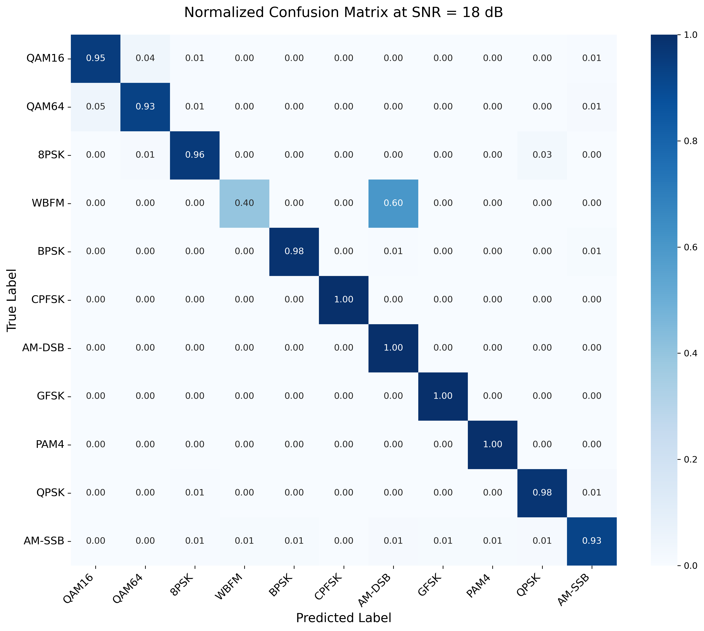

# DCS-Net: A Physical-aware Deep Network for Robust Modulation Classification under High-dynamic Doppler Scenarios

## Affiliations
- Huimeisun — **Suzhou University of Technology**
- Ziwen Qin — **Suzhou University of Technology**
- Wangye Jiang — **Suzhou University of Technology**
- Haoming Yang — **Jinling Institute of Technology**
- Jingya Zhang — **Suzhou University of Technology**

## Overview
This repository contains the official implementation of **DCS-Net**, a physical-aware deep network for robust automatic modulation classification under high-dynamic Doppler scenarios.

## Data

We conducted experiments on the **RML2016.10a** dataset.

### Dataset Summary

| Dataset | Modulation Formats | Samples |
| --- | --- | --- |
| RML2016.10a | 8 digital formats: 8PSK, BPSK, CPFSK, GFSK, PAM4, 16QAM, 64QAM, QPSK; 3 analog formats: AM-DSB, AM-SSB, WBFM | (2 × 128) |

### Download
The dataset can be downloaded from:

- https://www.deepsig.ai/
- DeepSig: **AI-Native Wireless Communications**

## Repository Structure

```text
DCS-Net/
├─ README.md
├─ LICENSE
├─ requirements.txt
├─ main.py
├─ dataset_process.py
├─ assets/
│  └─ confusion_metrics_18dB.png
├─ models/
│  └─ model.py
├─ data_loader/
│  └─ data_loader.py
└─ util/
   ├─ config.py
   ├─ early_stop.py
   ├─ logger.py
   ├─ training.py
   └─ utils.py
```

## Code Architecture

### 1. Entry Point
- **`main.py`**
  - Main script for experiment setup, model initialization, dataset loading, training, and final evaluation.

### 2. Model Definition
- **`models/model.py`**
  - Defines the full **DCS_Net** architecture and its internal modules:
    - **`RobustPDABlock`**  
      Extracts phase-difference-aware features from I/Q signals and smooths them using average pooling.
    - **`MultiScaleFeatureBlock`**  
      Builds local temporal features using stacked 1D convolutions, batch normalization, activation, and max pooling.
    - **`LSKA1D`**  
      A 1D large-kernel selective attention style module combining local and dilated depthwise convolutions for feature gating.
    - **`DCS_Net`**  
      The final network with three coordinated branches:
      - **IQ branch** for raw I/Q feature extraction,
      - **Magnitude branch** for envelope / amplitude-related information,
      - **PDA branch** for physically motivated phase-difference features.  
      The three branches are fused by a feature mixer, refined by attention-style gating, globally pooled, and then fed to the classifier.

### 3. Dataset Processing
- **`dataset_process.py`**
  - Provides preprocessing utilities to construct Doppler-corrupted samples from the original RadioML dataset.
  - Main functions:
    - **`inject_aerospace_degradation`**  
      Simulates high-dynamic Doppler effects by applying a progressive phase rotation to complex I/Q signals.
    - **`process_pkl_dataset`**  
      Reads the original `.pkl` dataset, injects the degradation for each modulation–SNR slice, and saves a processed `.pkl` file.
  - The default input / output paths are:
    - input: `data/radioml/RML2016.10a_dict.pkl`
    - output: `data/radioml/RML2016.10a_Aerospace_corrupted.pkl`

### 4. Data Loading
- **`data_loader/data_loader.py`**
  - **`Load_Dataset`**
    - Loads the processed dataset file `RML2016.10a_Aerospace_corrupted.pkl`.
    - Supports dataset name `2016.10a`.
    - Converts modulation labels to integer category IDs.
  - **`Dataset_Split`**
    - Splits samples into training, validation, and testing sets.
    - Preserves modulation / SNR slice-wise sampling behavior.
  - **`Create_Data_Loader`**
    - Wraps train and validation sets into PyTorch dataloaders.

### 5. Training Utilities
- **`util/training.py`**
  - Contains the training and validation pipeline.

- **`util/config.py`**
  - Provides experiment configuration management.

- **`util/early_stop.py`**
  - Provides early stopping support.

- **`util/logger.py`**
  - Provides logging and metric recording utilities.

- **`util/utils.py`**
  - Provides common helper functions.

## Environment
Install dependencies with:

```bash
pip install -r requirements.txt
```

## Data Preparation
This project expects the processed dataset file at:

```text
data/radioml/RML2016.10a_Aerospace_corrupted.pkl
```

If you only have the original dataset file, first generate the processed version by running:

```bash
python dataset_process.py
```

By default, the script reads:

```text
data/radioml/RML2016.10a_dict.pkl
```

and writes:

```text
data/radioml/RML2016.10a_Aerospace_corrupted.pkl
```

## Training
Run training with:

```bash
python main.py
```

Example with custom settings:

```bash
python main.py --dataset 2016.10a --epochs 100 --batch_size 256 --lr 0.001 --target_snrs all
```

Example for selected SNR values only:

```bash
python main.py --target_snrs -20,-18,-16
```

Example for resuming from a checkpoint:

```bash
python main.py --resume checkpoint/2016.10a_.pkl
```

## Main Arguments
`main.py` supports the following key arguments:

- `--dataset`: dataset name, default `2016.10a`
- `--seed`: random seed
- `--device`: training device, automatically selects CUDA if available
- `--ckpt_path`: checkpoint directory
- `--batch_size`: batch size
- `--target_snrs`: all SNRs or a comma-separated list
- `--lr_scheduler`: learning rate scheduler type (`default` or `cosine`)
- `--epochs`: number of training epochs
- `--patience`: early stopping patience
- `--lr`: learning rate
- `--num_classes`: number of modulation classes
- `--monitor`: checkpoint selection metric
- `--num_workers`: dataloader workers
- `--resume`: checkpoint path for resuming
- `--milestone_step`: learning rate decay trigger interval
- `--gamma`: learning rate decay factor

## Result
The repository includes the confusion matrix of DCS-Net at **18 dB**:



## Notes
- The current implementation supports the **RadioML 2016.10a** dataset format used in this repository.
- Runtime-generated directories such as `data/`, `checkpoint/`, and `log/` are excluded in `.gitignore`.
- The training script automatically saves the best-performing model according to validation accuracy.

## License
This project is released under the terms of the license provided in the `LICENSE` file.
